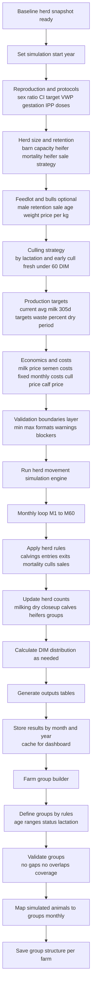

```mermaid
flowchart TD

B9[Baseline herd snapshot ready] --> P1[Set simulation start year]
P1 --> P2[Reproduction and protocols<br/>sex ratio CI target VWP gestation IPP doses]
P2 --> P3[Herd size and retention<br/>barn capacity heifer mortality heifer sale strategy]
P3 --> P4[Feedlot and bulls optional<br/>male retention sale age weight price per kg]
P4 --> P5[Culling strategy<br/>by lactation and early cull fresh under 60 DIM]
P5 --> P6[Production targets<br/>current avg milk 305d targets waste percent dry period]
P6 --> P7[Economics and costs<br/>milk price semen costs fixed monthly costs cull price calf price]
P7 --> P8[Validation boundaries layer<br/>min max formats warnings blockers]

P8 --> S0[Run herd movement simulation engine]
S0 --> S1[Monthly loop M1 to M60]
S1 --> S2[Apply herd rules<br/>calvings entries exits mortality culls sales]
S2 --> S3[Update herd counts<br/>milking dry closeup calves heifers groups]
S3 --> S4[Calculate DIM distribution as needed]
S4 --> S5[Generate outputs tables]
S5 --> S6[Store results by month and year<br/>cache for dashboard]

S6 --> G0[Farm group builder]
G0 --> G1[Define groups by rules<br/>age ranges status lactation]
G1 --> G2[Validate groups<br/>no gaps no overlaps coverage]
G2 --> G3[Map simulated animals to groups monthly]
G3 --> G4[Save group structure per farm]
```
