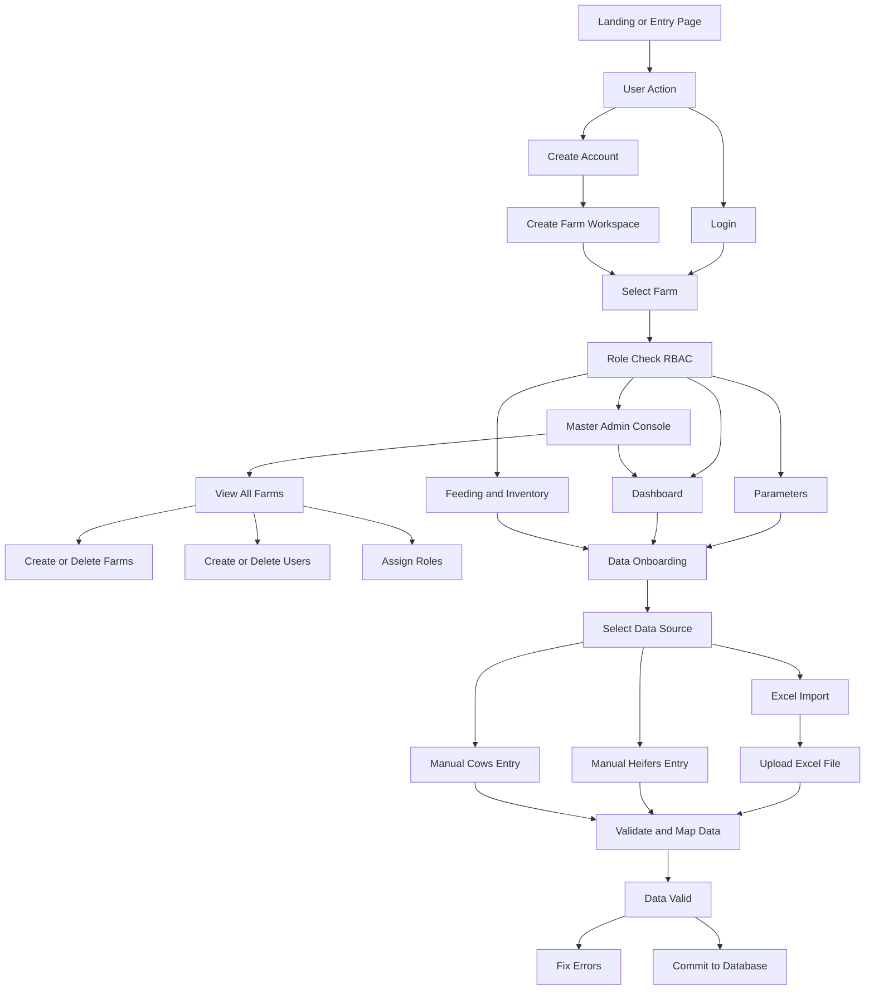

# Dairy-Flow 🐄 – Application Flowcharts

This document describes the main functional flow of the Dairy-Flow application.

---

## Diagram 1 — Entry, Access Control, Roles, and Data Onboarding

➡️ **Next:** Next: [Diagram 2 — Parameters, Herd Simulation, and Farm Grouping](diagram-2.md)

