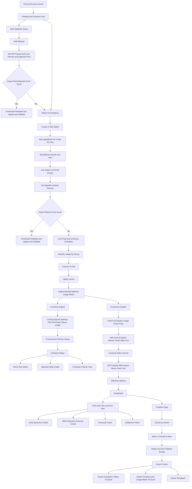

# Diagram 3 — Feeding, Inventory, Economics, Dashboard, and Exports

Back: [Diagram 2 — Parameters, Herd Simulation, and Farm Grouping](diagram-2.md)

```mermaid
flowchart TD

%% ENTRY FROM DIAGRAM 2
G4[Group Structure Saved] --> FI0[Feeding and Inventory Hub]

%% RAW MATERIALS SETUP
FI0 --> RM0[Raw Materials Setup]
RM0 --> RM1[Add Material]
RM1 --> RM2[Set DM Percent and Loss Percent and Optional Price]
RM2 --> RM3{Import Raw Materials From Excel}
RM3 -->|Yes| RM4[Download Template and Upload and Validate]
RM3 -->|No| RF0[Ration Formulations]

%% RATION FORMULATIONS
FI0 --> RF0
RF0 --> RF1[Create or Edit Ration]
RF1 --> RF2[Add Ingredients Per Head Per Day]
RF2 --> RF3[Set Effective Month and Year]
RF3 --> RF4[Link Ration to Animal Groups]
RF4 --> RF5[Set Appetite Scaling Percent]
RF5 --> RF6{Import Rations From Excel}
RF6 -->|Yes| RF7[Download Template and Upload and Validate]
RF6 -->|No| C0[Run Feed and Inventory Calculator]

%% FEED USAGE AND INVENTORY
C0 --> C1[Monthly Usage By Group]
C1 --> C2[Convert To DM]
C2 --> C3[Apply Losses]
C3 --> C4[Output Monthly Material Usage Matrix]
C4 --> I0[Inventory Engine]
I0 --> I1[Closing Equals Opening Plus Purchases Minus Usage]
I1 --> I2[Procurement Planner Inputs]
I2 --> I3[Inventory Pages]
I3 --> I4[Stock Flow Matrix]
I3 --> I5[Material Detail Graph]
I3 --> I6[Purchase Planner View]

%% ECONOMICS AND IOFC
C4 --> E0[Economics Engine]
E0 --> E1[Feed Cost Equals Usage Times Price]
E1 --> E2[Milk Income Equals Volume Times Milk Price]
E2 --> E3[Livestock Sales Income]
E3 --> E4[IOFC Equals Milk Income Minus Feed Cost]
E4 --> E5[Efficiency Metrics]

%% DASHBOARD AND EXPORTS
E5 --> D0[Dashboard]
D0 --> D1[KPIs One Year and Five Year]
D1 --> D2[Herd Dynamics Charts]
D1 --> D3[Milk Production Forecast Charts]
D1 --> D4[Financial Charts]
D1 --> D5[Drilldowns Filters]

D0 --> T0[Timeline Page]
T0 --> T1[Counts by Month]
T1 --> T2[Male vs Female Calves]
T2 --> T3[Heifers by Farm Defined Groups]
T3 --> X0[Export Center]
X0 --> X1[Export Simulation Tables To Excel]
X0 --> X2[Export Inventory and Usage Matrix To Excel]
X0 --> X3[Export Templates]
```
