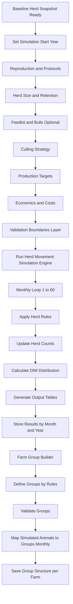

# Diagram 2 — Parameters, Herd Simulation, and Farm Grouping

Back to Diagram 1: [Diagram 1 — Entry, Access Control, Roles, and Data Onboarding](README.md)

```mermaid
flowchart TD

%% PARAMETERS WITH BOUNDARIES
B9[Baseline Herd Snapshot Ready] --> P1[Set Simulation Start Year]
P1 --> P2[Reproduction and Protocols]
P2 --> P3[Herd Size and Retention]
P3 --> P4[Feedlot and Bulls Optional]
P4 --> P5[Culling Strategy]
P5 --> P6[Production Targets]
P6 --> P7[Economics and Costs]
P7 --> P8[Validation Boundaries Layer]

%% HERD MOVEMENT SIMULATION
P8 --> S0[Run Herd Movement Simulation Engine]
S0 --> S1[Monthly Loop 1 to 60]
S1 --> S2[Apply Herd Rules]
S2 --> S3[Update Herd Counts]
S3 --> S4[Calculate DIM Distribution]
S4 --> S5[Generate Output Tables]
S5 --> S6[Store Results by Month and Year]

%% FARM GROUPING
S6 --> G0[Farm Group Builder]
G0 --> G1[Define Groups by Rules]
G1 --> G2[Validate Groups]
G2 --> G3[Map Simulated Animals to Groups Monthly]
G3 --> G4[Save Group Structure per Farm]
```
